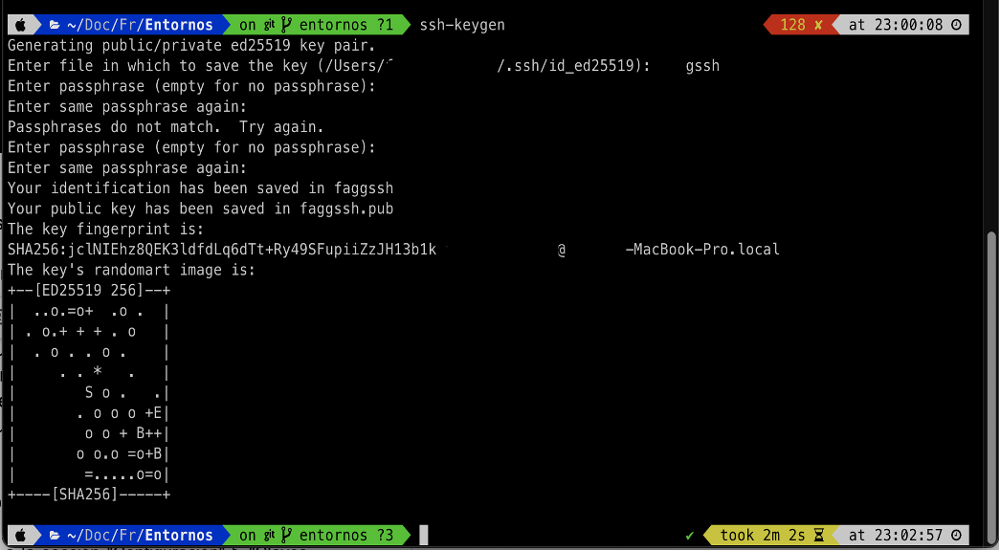

# FrancisAngely

# Manual de usuario para claves SSH en GitHub

## Indice

* [Introducción](#introducción)

* [Requisitos previos](#requisitos-previos)

* [Paso 1: Generar claves SSH](#paso-1-generar-claves-ssh)

* [Paso 2: Agregar la clave pública a GitHub](#paso-2-agregar-la-clave-pública-a-github)

* [Paso 3: Usar claves SSH para autenticarse](#paso-3-usar-claves-ssh-para-autenticarse)

* [Pasos adicionales](#pasos-adicionales)

* [Recursos adicionales](#recursos-adicionales)

* [Resumen](#resumen)

## Introducción 

Las claves SSH son una forma segura de autenticarse en GitHub y acceder a tus repositorios. Son una alternativa a las contraseñas, que pueden ser menos seguras y más engorrosas de usar.

> Este manual te guiará a través del proceso de creación, uso e implementación de claves SSH en GitHub.

## Requisitos previos

- Tener una cuenta de GitHub

- Un ordenador con un terminal o línea de comandos

## Paso 1: Generar claves SSH

1. Abre un terminal o línea de comandos en tu ordenador.

2. Ejecuta el siguiente comando para generar un par de claves SSH: `ssh-keygen`.

3. Se te pedirá que introduzcas un nombre de archivo para tus claves. El nombre por defecto es `id_rsa`, pero puedes elegir uno diferente.

4. Opcionalmente, puedes establecer una frase de contraseña para tus claves. Esto añadirá una capa adicional de seguridad, pero te pedirá que introduzcas la frase de contraseña cada vez que uses las claves.

5. Guarda las claves en un lugar seguro de tu ordenador.

## Paso 2: Agregar la clave pública a GitHub

1. Accede a tu cuenta de GitHub y ve a la sección "Configuración" > "Claves SSH y GPG".

2. Haz clic en el botón "Nueva clave SSH".

3. Pega la clave pública SSH en el campo "Clave". La clave pública es el archivo que termina con .pub.

	* $ clip < ~/.ssh/id_ed25519.pub
    * #Copies the contents of the id_ed25519.pub file to your clipboard

4. Comandos para copiar la llave SSH:
    * Mac: pbcopy < ~/.ssh/id_rsa.pub
    * Windows (Git Bash): clip < ~/.ssh/id_rsa.pub
    * Linux (Ubuntu): cat ~/.ssh/id_rsa.pub

5. Dale un nombre a la clave (por ejemplo, "Mi clave personal").

6. Haz clic en "Añadir clave SSH".

## Paso 3: Usar claves SSH para autenticarse

1. Una vez que hayas agregado tu clave pública a GitHub, puedes usarla para autenticarte en GitHub desde tu terminal o línea de comandos.

2. Antes de crear el repositorio se debe crear un token personal el cual se usará como el password cuando vayas a clonar el repositorio. 

3. En el menu Settings >> Developer Setting >> Tokens (classic)

4. Para clonar un repositorio, utiliza el siguiente comando, sustituyendo https://github.com/REPOSITORY por la URL del repositorio: git clone git@github.com:https://github.com/REPOSITORY.git

5. Se te pedirá que introduzcas el usuario y el password (token personal).

6. A partir de entonces, podrás clonar, actualizar y empujar cambios a tus repositorios sin necesidad de introducir tu contraseña.

7. Hacemos un cambio en el archivo README.md y hacemos el git push.

## Pasos adicionales

* Puedes generar y agregar varias claves SSH para diferentes propósitos. Por ejemplo, puedes tener una clave para tu ordenador personal y otra para tu portátil de trabajo.

* Si pierdes tus claves privadas, tendrás que generar un nuevo par de claves y agregarlas a GitHub.

* Puedes eliminar las claves SSH que ya no uses desde la sección "Configuración" > "Claves SSH y GPG" de tu cuenta de GitHub.

## Recursos adicionales

* [Documentación de autenticación](https://docs.github.com/es/authentication)

* [Cómo generar claves SSH para GitHub](https://docs.github.com/es/authentication/connecting-to-github-with-ssh/generating-a-new-ssh-key-and-adding-it-to-the-ssh-agent)

## Resumen

>Las claves SSH son una forma segura y cómoda de autenticarse en GitHub. Siguiendo los pasos de este manual, puedes crear, usar e implementar claves SSH para mejorar tu experiencia con GitHub.
 

